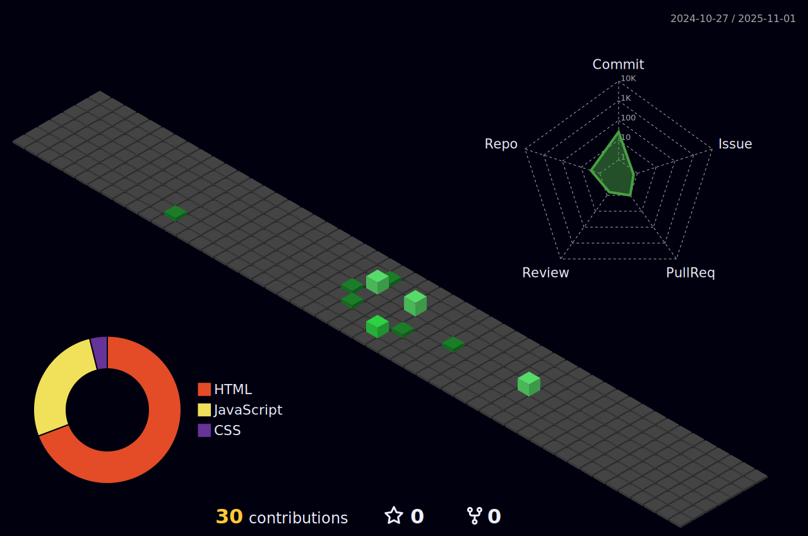

# 👨‍💻 João Pedro Prestes - Desenvolvedor Mobile e Front-End

Bem-vindo ao meu perfil no GitHub! Sou formado em **Informática para Internet** pelo IFRS - Campus Rio Grande e atualmente curso **Engenharia da Computação** na FURG. Trabalho como **Desenvolvedor Júnior Mobile e Front-End** na **Augen Engenharia SA**.
---

---

## 🚀 Tecnologias e Ferramentas

### Linguagens

### Frameworks e Bibliotecas

### Bancos de Dados

### Ferramentas

---

## 📊 Estatísticas do GitHub

### Linguagens Mais Utilizadas

---

## 🛠️ Boas Práticas

- **Clean Code**: Sempre busco escrever código limpo, legível e bem documentado.
- **Responsividade**: Foco em criar interfaces que funcionem bem em diferentes dispositivos.
- **Versionamento**: Utilizo Git para controle de versão e organização de projetos.

---

## 🌱 Projetos Populares

### [Fortnite Stats](https://github.com/jpprestes1/projetonext)
> Um projeto em Next que busca em compara estatísticas de jogadores de Fortnite.

### [RotasRS](https://github.com/jpprestes1/RotasRS)
> Ferramenta em JavaScript para auxiliar no planejamento de uma viagem.

### [LinkTree](https://github.com/jpprestes1/lidesut)
> Projeto em HTML para solucionar um problema para árvores de links.

---

## 📫 Contato

- **LinkedIn**: [João Pedro Prestes](https://www.linkedin.com/in/jpprestes1/)
- **GitHub**: [jpprestes1](https://github.com/jpprestes1)

---

Obrigado por visitar meu perfil! 😊
